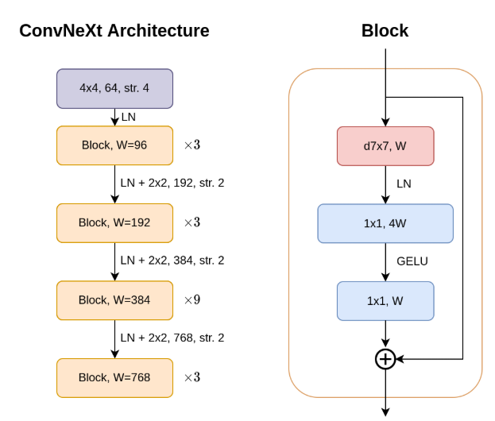
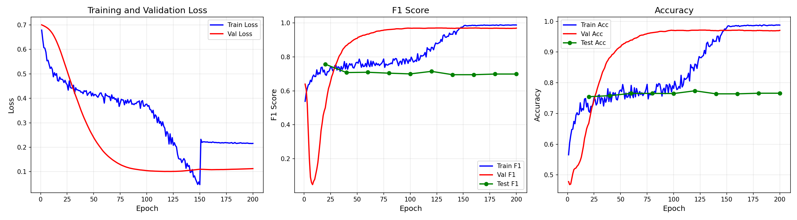
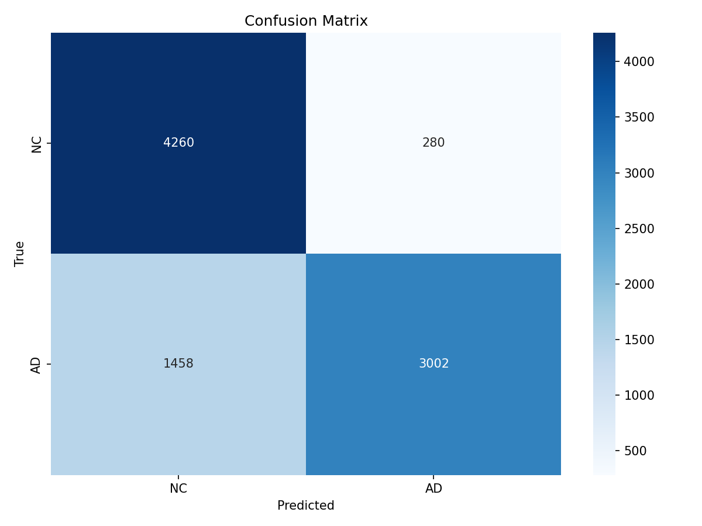
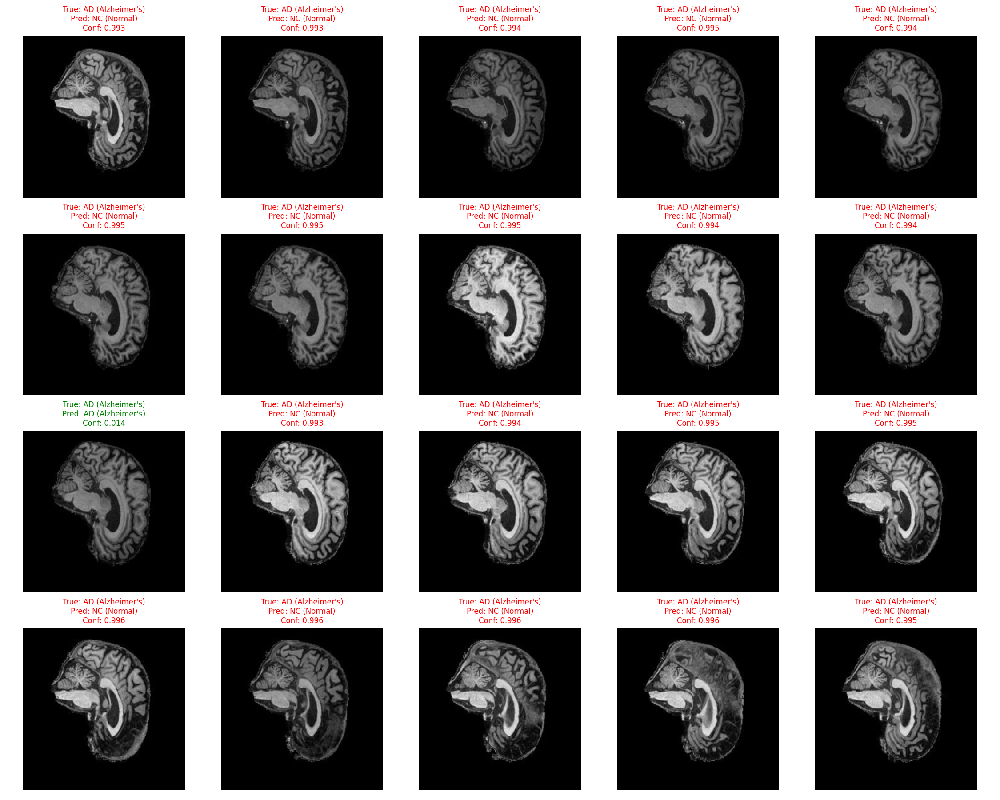

# Alzheimer's Disease Classification with ConvNeXt (ADNI)

Binary AD vs NC MRI slice classification using a lightweight ConvNeXt implementation, subject-wise split, and strong augmentations.

# Table of Contents

- [Goal](#goal)
- [Model Architecture](#model-architecture)
  - [Adaptation for ADNI Dataset](#adaptation-for-adni-dataset)
- [Dataset](#dataset)
- [Training](#training)
- [Results](#results)
- [Usage](#usage)
  - [Install dependencies](#install-dependencies)
  - [Train](#train)
  - [Predict / Evaluate](#predict--evaluate)
  - [Example inputs/outputs](#example-inputsoutputs)
- [Hyperparameters](#hyperparameters)
- [Project structure](#project-structure)
- [References](#references)

## Goal

Classify brain MR images from the ADNI dataset into two classes: Alzheimer's Disease (AD) and Normal Control (NC). The pipeline targets robust generalization through subject-wise splits and carefully chosen augmentations/regularization.

# Model Architecture

- **Backbone: ConvNeXt (small)** implemented in `modules.py`.
  
  - Block: 7×7 depthwise conv → LayerNorm → 4× expansion MLP (Linear → GELU → Linear) → residual with optional DropPath and per‑channel LayerScale.
  - Stem: 4×4 Conv2d (stride 4), LayerNorm.
  - 4 stages with downsampling (2×2 Conv2d, stride 2) between stages; default depths `[3, 3, 27, 3]`, dims `[96, 192, 384, 768]`.
  - Global average pooling → LayerNorm.
- **Head:** single‑stage `Linear(dims[-1] → 1)` for binary logits.
- **Regularization & stabilization:**
  - LayerScale (init 1e‑6), optional DropPath.
  - Exponential Moving Average (EMA) of weights (enabled by default in `train.py`).

#### Adaptation for ADNI Dataset

- Grayscale MRI replicated to 3 channels to match ConvNeXt stem; resized to 224×224.
- Augmentations include RandAugment, Random Erasing, and horizontal flips to improve robustness.
- Regularization tuned for small data (LayerScale, label smoothing, EMA).
- Subject‑wise split by patient ID to prevent leakage across splits.

# Dataset

- **Expected directory layout** (set root with `--data_path`, defaults to `ADNI/AD_NC`):

```
ADNI/AD_NC
├── train
│   ├── AD
│   │   ├── <subjectId_xxx>.jpeg
│   └── NC
│       ├── <subjectId_xxx>.jpeg
└── test
    ├── AD
    └── NC
```

- **Description**: The ADNI dataset contains MRI scans labeled as Alzheimer's Disease (AD) or Normal Control (NC). Each image is grayscale with original resolution 256×240 and is padded to 256×256 (then resized to 224×224 for training/inference).

- **Training split (train/val):**
  - Derived from filenames: subject id is the prefix before the first underscore (see `ADNIDataset._extract_subject_id`).
  - `create_subject_split(..., train_ratio=0.9)` builds a 90/10 split by subject per class to prevent leakage across splits.

- **Transforms (224×224):**
  - Train: `Resize` → `RandomHorizontalFlip` → `RandAugment(num_ops=9, magnitude=9)` → `ToTensor` → `Normalize(ImageNet mean/std)` → `RandomErasing(p=0.25)`.
  - Val/Test: `Resize` → `ToTensor` → `Normalize`.

# Training Process

Training script: `train.py`.

- Loss: `BCEWithLogitsLoss` on a single logit output.
- Optimizer: AdamW; default `lr=5e-4`, `weight_decay=0.1`, `betas=(0.9, 0.999)`.
- LR schedule: linear warmup (`warmup_epochs=4`) → cosine decay (`WarmupCosineScheduler`).
- MixUp/CutMix: enabled early, linearly decayed, disabled after epoch 150 by default.
- Label smoothing: 0.1 for vanilla batches (no mixing).
- EMA: `timm.utils.ModelEma` (default enabled) with decay `0.9999`.
- Checkpoints: saves best by F1 (`best_model_f1.pth`), best by Accuracy (`best_model_acc.pth`), periodic `checkpoint_epoch_*.pth`.
 

### Hyperparameters

Defaults used (see `train.py`):

| Hyperparameter            | Value          |
|---------------------------|----------------|
| Optimizer                 | AdamW          |
| Learning Rate             | 5e-4           |
| Min LR (cosine floor)     | 1e-6           |
| Weight Decay              | 0.1            |
| Betas                     | (0.9, 0.999)   |
| Batch Size                | 4              |
| Epochs                    | 200            |
| Warmup Epochs             | 4              |
| Input Size                | 224            |
| Drop Path Rate            | 0.0            |
| Layer Scale Init          | 1e-6           |
| MixUp Alpha               | 0.8            |
| CutMix Alpha              | 1.0            |
| Label Smoothing           | 0.1            |
| EMA                       | True (0.9999)  |
| Loss                      | BCEWithLogits  |

# Project structure

```
recognition/ConvNeXt_ADNI_s4909455
├── ADNI/AD_NC/            # data root (train/test subfolders with AD, NC)
├── Images/                # generated figures
│   ├── confusion_matrix.png
│   ├── roc_curve.png
│   ├── probability_distribution.png
│   └── training_final.png
├── dataset.py             # dataset + transforms + subject-wise split
├── modules.py             # ConvNeXt backbone and head
├── train.py               # training loop, EMA, scheduler, checkpoints
└── predict.py             # evaluation/inference, metrics and plots
```

Key defaults (see `argparse` in `train.py`):

- `--epochs 200`  `--batch_size 4`  `--input_size 224`  `--num_workers 8`  `--seed 42`
- `--drop_path_rate 0.0`  `--layer_scale_init_value 1e-6`
- `--use_ema` (default True)  `--ema_decay 0.9999`

# Results

#### Performance Metrics

The training and validation losses and accuracies were recorded across 200 epochs, as shown below.



- Rapid improvement in the early epochs, followed by smooth convergence under cosine scheduling.
- Brief wobble segments are expected from learning-rate transitions; overall trends are stable.
- A small, consistent generalization gap (train slightly below/around val) indicates limited overfitting with MixUp/CutMix and EMA.
- Best checkpoints are saved by highest validation F1 and Accuracy.

#### Confusion Matrix



- The confusion matrix visualises performance across both classes on 9,000 test images (threshold = 0.01).
- AD (Alzheimer’s Disease): 3,002 correctly predicted, 1,458 misclassified as NC.
- NC (Normal Control): 4,260 correctly predicted, 280 misclassified as AD.

#### Example Predictions


# Usage

### Install dependencies

This project uses PyTorch, torchvision, timm, and common ML/plotting libs.

```bash
pip install torch torchvision timm scikit-learn seaborn matplotlib tqdm pillow
```

### Train

```bash
cd recognition/ConvNeXt_ADNI_s4909455
python train.py \
  --data_path ADNI/AD_NC \
  --output_dir ADNI_outputs
```

Common flags:

- `--epochs 200` `--batch_size 4` `--lr 5e-4` `--num_workers 8`
- `--drop_path_rate 0.0` `--layer_scale_init_value 1e-6`
- `--save_freq 20`

Artifacts are written to `--output_dir` (checkpoints, plots, `test_results.npy`).

### Predict / Evaluate

```bash
python predict.py \
  --checkpoint ADNI_outputs/best_model_acc.pth \
  --data_path ADNI/AD_NC \
  --split test \
  --output_dir ADNI_outputs/predictions \
  --threshold 0.01 \
  --batch_size 32
```

Outputs (per split) are saved under `--output_dir/<split>/`:

- `confusion_matrix.png`, `roc_curve.png`, `probability_distribution.png`, `prediction_examples.png`.


### Example inputs/outputs

Command:

```bash
python predict.py \
  --checkpoint ADNI_outputs/best_model_acc.pth \
  --data_path ADNI/AD_NC \
  --split test \
  --threshold 0.01
```

Abridged output:

```
Using device: cuda
Loaded EMA model weights
Detected two-stage head architecture (with head_norm)
TEST RESULTS (Threshold=0.010)
F1 Score:  0.7755
Accuracy:  0.8069
Confusion Matrix:
                  Predicted
                  NC    AD
True    NC      4260   280
        AD      1458  3002
```

Plots are saved under `ADNI_outputs/predictions/test/`.

# References
<a id="ConvNeXt">[1]</a> Liu Z, Mao H, Wu C-Y, Feichtenhofer C, Darrell T, Xie S (2022). A ConvNet for the 2020s. arXiv:2201.03545. https://arxiv.org/abs/2201.03545

<a id="ADNI">[2]</a> Alzheimer's Disease Neuroimaging Initiative (ADNI). https://adni.loni.usc.edu/

<a id="Aug">[3]</a> Ekin D. Cubuk, Barret Zoph, Jonathon Shlens, Quoc V. Le (2019). RandAugment: Practical automated data augmentation with a reduced search space. arXiv:1909.13719 https://arxiv.org/abs/1909.13719

<a id="<Mixup>">[4]</a> Hongyi Zhang, Moustapha Cisse, Yann N. Dauphin, David Lopez-Paz (2017). mixup: Beyond Empirical Risk Minimization. arXiv:1710.09412 https://arxiv.org/abs/1710.09412

<a id="Cutmix">[5]</a> Sangdoo Yun, Dongyoon Han, Seong Joon Oh, Sanghyuk Chun, Junsuk Choe, Youngjoon Yoo (2019). CutMix: Regularization Strategy to Train Strong Classifiers with Localizable Features. arXiv:1905.04899 https://arxiv.org/abs/1905.04899

<a id="EMA">[6]</a> Daniel Morales-Brotons, Thijs Vogels, Hadrien Hendrikx (2024). Exponential Moving Average of Weights in Deep Learning: Dynamics and Benefits. arXiv:2411.18704 https://arxiv.org/abs/2411.18704